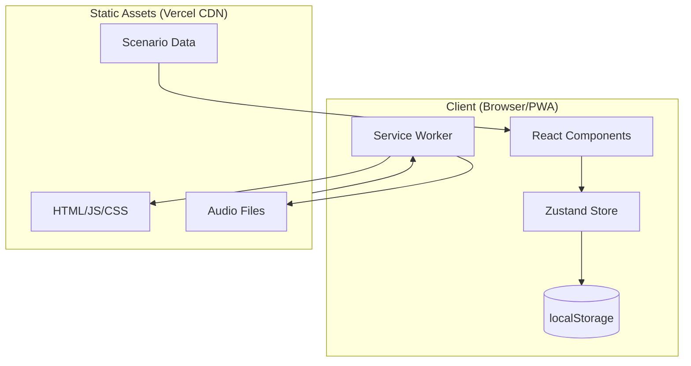
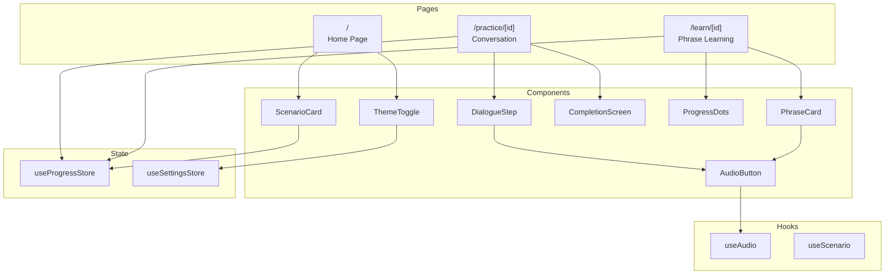
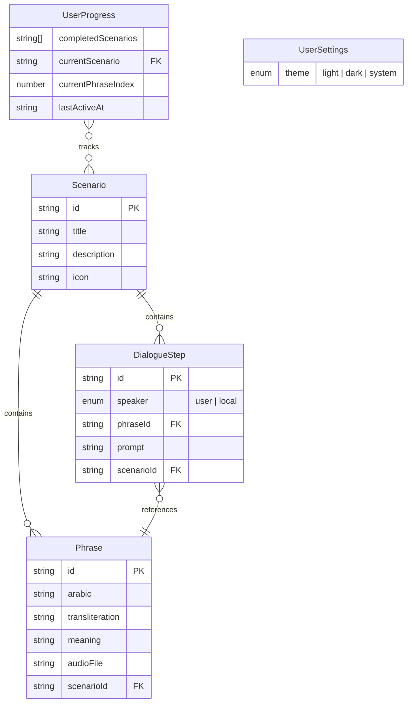

# Gulf Arabic Basics — Software Architecture

**Version:** MVP v1.0
**Last Updated:** February 2025

---

## 1. System Overview

### High-Level Architecture



### Architecture Pattern

**Static-first PWA**: Statically exported Next.js site with client-side state. No backend, no API routes, no database.

| Aspect | Approach |
|--------|----------|
| Rendering | Static Site Generation (SSG) |
| State | Client-side only (Zustand → localStorage) |
| Data | Bundled at build time |
| Offline | Service worker precaches all assets |

### Component Relationships



---

## 2. Technology Stack

### Frontend

| Layer | Technology | Version | Purpose |
|-------|------------|---------|---------|
| Framework | Next.js (App Router) | 14.1+ | Routing, SSG, optimization |
| Language | TypeScript | 5.3+ | Type safety |
| UI Library | React | 18.2+ | Component model |
| Styling | Tailwind CSS | 3.4+ | Utility-first CSS |
| State | Zustand | 4.5+ | Client state + persistence |
| Animation | CSS transitions | — | Lightweight motion |

### Backend

**None for MVP.** This is a fully static application.

| Aspect | MVP Approach | Future Option |
|--------|--------------|---------------|
| API | None—all data bundled | Next.js API routes |
| Authentication | None | NextAuth.js, Clerk |
| Database | None—localStorage only | Supabase, PlanetScale |
| File storage | Static `/public` folder | Cloudflare R2, S3 |

### Database

**None for MVP.** User data stored in browser localStorage via Zustand persist middleware.

| Data | Storage | Persistence |
|------|---------|-------------|
| User progress | localStorage | Per-browser, cleared if user clears data |
| User settings | localStorage | Per-browser |
| Scenario content | Bundled JS | Immutable, updated via deploy |

### Infrastructure

| Layer | Technology | Purpose |
|-------|------------|---------|
| Hosting | Vercel | Static hosting, CDN, CI/CD |
| PWA | next-pwa | Service worker, manifest |
| Domain | Vercel (default) | `*.vercel.app` free subdomain |

### Key Libraries

| Package | Purpose | Bundle Size |
|---------|---------|-------------|
| `next` | Framework | Core |
| `react` / `react-dom` | UI | Core |
| `zustand` | State management | ~1kb |
| `next-pwa` | PWA support | Build-time only |
| `tailwindcss` | Styling | Build-time only |

---

## 2. Project Structure

### Folder Organization

```
arabic/
├── public/
│   ├── audio/                    # MP3 files for phrases
│   │   ├── shlonak-zain.mp3
│   │   ├── al-hamdulillah.mp3
│   │   └── ...
│   ├── icons/                    # PWA icons
│   │   ├── icon-192.png
│   │   └── icon-512.png
│   └── manifest.json             # PWA manifest
├── src/
│   ├── app/                      # Next.js App Router
│   │   ├── layout.tsx            # Root layout (fonts, theme)
│   │   ├── page.tsx              # Home: scenario list
│   │   ├── learn/
│   │   │   └── [scenarioId]/
│   │   │       └── page.tsx      # Phrase learning flow
│   │   └── practice/
│   │       └── [scenarioId]/
│   │           └── page.tsx      # Conversation practice
│   ├── components/
│   │   ├── ui/                   # Generic UI components
│   │   │   ├── Button.tsx
│   │   │   ├── Card.tsx
│   │   │   ├── ProgressDots.tsx
│   │   │   └── ThemeToggle.tsx
│   │   ├── PhraseCard.tsx        # Phrase display component
│   │   ├── AudioButton.tsx       # Audio playback button
│   │   ├── ScenarioCard.tsx      # Scenario list item
│   │   ├── DialogueStep.tsx      # Conversation step
│   │   └── CompletionScreen.tsx  # Scenario completion
│   ├── data/
│   │   └── scenarios.ts          # Static content (typed)
│   ├── store/
│   │   ├── useProgressStore.ts   # Learning progress state
│   │   └── useSettingsStore.ts   # Theme, preferences
│   ├── hooks/
│   │   ├── useAudio.ts           # Audio playback hook
│   │   └── useScenario.ts        # Scenario data access
│   ├── types/
│   │   └── index.ts              # TypeScript interfaces
│   └── lib/
│       └── utils.ts              # Utility functions
├── tailwind.config.ts            # Design system tokens
├── next.config.js                # Next.js + PWA config
├── tsconfig.json
└── package.json
```

### File Naming Conventions

| Type | Convention | Example |
|------|------------|---------|
| React components | PascalCase | `PhraseCard.tsx`, `AudioButton.tsx` |
| Pages (App Router) | lowercase `page.tsx` | `app/learn/[scenarioId]/page.tsx` |
| Layouts | lowercase `layout.tsx` | `app/layout.tsx` |
| Hooks | camelCase with `use` prefix | `useAudio.ts`, `useProgressStore.ts` |
| Utilities | camelCase | `utils.ts`, `helpers.ts` |
| Types | PascalCase for types, `index.ts` for barrel | `types/index.ts` |
| Static data | camelCase | `scenarios.ts` |
| Audio files | kebab-case matching phrase ID | `shlonak-zain.mp3` |
| Config files | lowercase with dots | `tailwind.config.ts`, `next.config.js` |
| CSS | lowercase | `globals.css` |

### Folder Purposes

| Folder | Purpose |
|--------|---------|
| `src/app/` | Next.js App Router pages and layouts |
| `src/components/` | React components (feature-specific) |
| `src/components/ui/` | Reusable UI primitives (Button, Card, etc.) |
| `src/data/` | Static content (scenarios, phrases) |
| `src/store/` | Zustand stores |
| `src/hooks/` | Custom React hooks |
| `src/types/` | TypeScript interfaces and types |
| `src/lib/` | Utility functions, helpers |
| `public/audio/` | Audio files (MP3) |
| `public/icons/` | PWA icons |

---

## 3. Dependencies

### Core Dependencies

```json
{
  "dependencies": {
    "next": "^14.1.0",
    "react": "^18.2.0",
    "react-dom": "^18.2.0",
    "zustand": "^4.5.0"
  }
}
```

### Development Dependencies

```json
{
  "devDependencies": {
    "typescript": "^5.3.0",
    "@types/react": "^18.2.0",
    "@types/node": "^20.11.0",
    "tailwindcss": "^3.4.0",
    "postcss": "^8.4.0",
    "autoprefixer": "^10.4.0",
    "next-pwa": "^5.6.0"
  }
}
```

### Package Rationale

| Package | Purpose | Size |
|---------|---------|------|
| next | Framework, routing, static export | Core |
| zustand | State management with localStorage persist | ~1kb |
| tailwindcss | Utility CSS, design tokens | Dev only |
| next-pwa | Service worker, offline support, manifest | Dev only |

**Total runtime JS (estimated):** ~90kb gzipped (React + Next.js + Zustand)

---

## 4. Data Model

### Entity Relationship Diagram



### Entity Definitions

| Entity | Purpose | Storage |
|--------|---------|---------|
| Scenario | A learning module (e.g., Coffee Shop) | Static (bundled) |
| Phrase | Single Arabic phrase with translations | Static (bundled) |
| DialogueStep | One step in conversation practice | Static (bundled) |
| UserProgress | Tracks completed scenarios and position | localStorage |
| UserSettings | Theme preference | localStorage |

### TypeScript Interfaces

```typescript
// src/types/index.ts

export interface Phrase {
  id: string;
  arabic: string;
  transliteration: string;
  meaning: string;
  audioFile: string;  // filename in /public/audio/
}

export interface DialogueStep {
  id: string;
  speaker: 'user' | 'local';
  phraseId: string;
  prompt: string;  // Context shown to user
}

export interface Scenario {
  id: string;
  title: string;
  description: string;
  icon: string;  // emoji or icon name
  phrases: Phrase[];
  dialogue: DialogueStep[];
}

export interface UserProgress {
  completedScenarios: string[];
  currentScenario: string | null;
  currentPhraseIndex: number;
  lastActiveAt: string;  // ISO timestamp
}

export interface UserSettings {
  theme: 'light' | 'dark' | 'system';
}
```

### Schema Design

**Static Content (bundled in JS):**

```typescript
// Scenarios are nested—phrases and dialogue embedded in scenario
{
  scenarios: [
    {
      id: "coffee-shop",
      title: "Coffee Shop",
      phrases: [ /* embedded */ ],
      dialogue: [ /* embedded */ ]
    }
  ]
}
```

**User Data (localStorage):**

```json
{
  "gulf-arabic-progress": {
    "state": {
      "completedScenarios": ["coffee-shop"],
      "currentScenario": null,
      "currentPhraseIndex": 0,
      "lastActiveAt": "2025-02-03T10:30:00Z"
    },
    "version": 0
  },
  "gulf-arabic-settings": {
    "state": {
      "theme": "system"
    },
    "version": 0
  }
}
```

### Static Content Structure

```typescript
// src/data/scenarios.ts

import { Scenario } from '@/types';

export const scenarios: Scenario[] = [
  {
    id: 'greetings',
    title: 'Greetings & Small Talk',
    description: 'Make connections at networking events',
    icon: '👋',
    phrases: [
      {
        id: 'as-salamu-alaykum',
        arabic: 'السلام عليكم',
        transliteration: 'As-salamu alaykum',
        meaning: 'Peace be upon you',
        audioFile: 'as-salamu-alaykum.mp3',
      },
      // ... 14 more phrases
    ],
    dialogue: [
      {
        id: 'step-1',
        speaker: 'local',
        phraseId: 'as-salamu-alaykum',
        prompt: 'Someone greets you at a networking event',
      },
      // ... more steps
    ],
  },
  {
    id: 'workplace',
    title: 'Workplace',
    description: 'Daily interactions with colleagues',
    icon: '💼',
    phrases: [ /* 15 phrases */ ],
    dialogue: [ /* dialogue steps */ ],
  },
  {
    id: 'coffee-shop',
    title: 'Coffee Shop',
    description: 'Order your morning coffee like a local',
    icon: '☕',
    phrases: [ /* 10 phrases */ ],
    dialogue: [ /* dialogue steps */ ],
  },
  {
    id: 'common-expressions',
    title: 'Common Expressions',
    description: 'Phrases that work everywhere',
    icon: '💬',
    phrases: [ /* 20 phrases */ ],
    dialogue: [ /* dialogue steps */ ],
  },
];
```

**Content Summary:**

| Scenario | Phrases | Focus |
|----------|---------|-------|
| Greetings & Small Talk | 15 | Networking, meeting people |
| Workplace | 15 | Office interactions, colleagues |
| Coffee Shop | 10 | Ordering, paying |
| Common Expressions | 20 | Universal responses |
| **Total** | **60** | |

---

## 5. API Design

### MVP: No API Required

This is a fully static application. All content is bundled at build time, and user state is stored in localStorage.

| Data Flow | Approach |
|-----------|----------|
| Scenario content → App | Imported from `src/data/scenarios.ts` at build |
| User progress → Storage | Zustand persist → localStorage |
| Audio files → Player | Static files from `/public/audio/` |

### Future API Endpoints (Post-MVP)

If the app evolves to need a backend, here's the anticipated API structure:

| Endpoint | Method | Purpose | Request | Response |
|----------|--------|---------|---------|----------|
| `/api/scenarios` | GET | List all scenarios | — | `Scenario[]` |
| `/api/scenarios/[id]` | GET | Get single scenario | — | `Scenario` |
| `/api/progress` | GET | Get user progress | Auth header | `UserProgress` |
| `/api/progress` | PUT | Update progress | `UserProgress` | `UserProgress` |

**Note:** These are not implemented in MVP. Documented for future reference.

---

## 6. State Management

### Progress Store

```typescript
// src/store/useProgressStore.ts

import { create } from 'zustand';
import { persist } from 'zustand/middleware';
import { UserProgress } from '@/types';

interface ProgressState extends UserProgress {
  // Actions
  completeScenario: (scenarioId: string) => void;
  setCurrentScenario: (scenarioId: string | null) => void;
  setCurrentPhraseIndex: (index: number) => void;
  resetProgress: () => void;
}

const initialState: UserProgress = {
  completedScenarios: [],
  currentScenario: null,
  currentPhraseIndex: 0,
  lastActiveAt: new Date().toISOString(),
};

export const useProgressStore = create<ProgressState>()(
  persist(
    (set) => ({
      ...initialState,

      completeScenario: (scenarioId) =>
        set((state) => ({
          completedScenarios: state.completedScenarios.includes(scenarioId)
            ? state.completedScenarios
            : [...state.completedScenarios, scenarioId],
          currentScenario: null,
          currentPhraseIndex: 0,
          lastActiveAt: new Date().toISOString(),
        })),

      setCurrentScenario: (scenarioId) =>
        set({
          currentScenario: scenarioId,
          currentPhraseIndex: 0,
          lastActiveAt: new Date().toISOString(),
        }),

      setCurrentPhraseIndex: (index) =>
        set({
          currentPhraseIndex: index,
          lastActiveAt: new Date().toISOString(),
        }),

      resetProgress: () => set(initialState),
    }),
    {
      name: 'gulf-arabic-progress',
    }
  )
);
```

### Settings Store

```typescript
// src/store/useSettingsStore.ts

import { create } from 'zustand';
import { persist } from 'zustand/middleware';
import { UserSettings } from '@/types';

interface SettingsState extends UserSettings {
  setTheme: (theme: UserSettings['theme']) => void;
}

export const useSettingsStore = create<SettingsState>()(
  persist(
    (set) => ({
      theme: 'system',
      setTheme: (theme) => set({ theme }),
    }),
    {
      name: 'gulf-arabic-settings',
    }
  )
);
```

---

## 7. Routing

### Route Structure

| Route | Purpose | Component |
|-------|---------|-----------|
| `/` | Home—scenario list with progress | `app/page.tsx` |
| `/learn/[scenarioId]` | Phrase learning flow | `app/learn/[scenarioId]/page.tsx` |
| `/practice/[scenarioId]` | Conversation practice | `app/practice/[scenarioId]/page.tsx` |

### User Flow

```
/ (Home)
├── User sees 4 scenarios:
│   ├── Greetings & Small Talk (15 phrases)
│   ├── Workplace (15 phrases)
│   ├── Coffee Shop (10 phrases)
│   └── Common Expressions (20 phrases)
├── Taps "Greetings & Small Talk"
└── → /learn/greetings
        ├── User learns phrases (swipe/tap through)
        ├── Taps "Continue" through each
        └── After last phrase → /practice/greetings
                                ├── Tap-to-reveal dialogue
                                ├── Completes conversation
                                └── → / (Home) with "Greetings ✓"
```

---

## 8. PWA Configuration

### next.config.js

```javascript
const withPWA = require('next-pwa')({
  dest: 'public',
  register: true,
  skipWaiting: true,
  disable: process.env.NODE_ENV === 'development',
});

/** @type {import('next').NextConfig} */
const nextConfig = {
  output: 'export',  // Static export for Vercel
  images: {
    unoptimized: true,  // Required for static export
  },
};

module.exports = withPWA(nextConfig);
```

### public/manifest.json

```json
{
  "name": "Gulf Arabic Basics",
  "short_name": "Yalla",
  "description": "Learn practical Gulf Arabic phrases",
  "start_url": "/",
  "display": "standalone",
  "background_color": "#FDF8F3",
  "theme_color": "#C17A5A",
  "icons": [
    {
      "src": "/icons/icon-192.png",
      "sizes": "192x192",
      "type": "image/png"
    },
    {
      "src": "/icons/icon-512.png",
      "sizes": "512x512",
      "type": "image/png"
    }
  ]
}
```

### Offline Strategy

- **Precache:** All static assets (HTML, CSS, JS, audio files)
- **Runtime cache:** None needed (no API calls)
- **Audio files:** Bundled in `/public/audio/`, precached by service worker

---

## 9. Styling Architecture

### Tailwind Configuration

```typescript
// tailwind.config.ts

import type { Config } from 'tailwindcss';

const config: Config = {
  content: ['./src/**/*.{js,ts,jsx,tsx,mdx}'],
  darkMode: 'class',
  theme: {
    extend: {
      colors: {
        // Light mode
        cream: '#FDF8F3',
        sand: '#F5EDE4',
        terracotta: '#C17A5A',
        'warm-brown': '#8B6F5C',
        charcoal: '#3D3530',
        'warm-gray': '#7A6F66',
        sage: '#7D9B76',
        sienna: '#A65D3F',
        // Dark mode
        'deep-brown': '#1F1A17',
        'warm-charcoal': '#2D2622',
        'soft-terracotta': '#D4896B',
        'muted-sand': '#A69383',
        'warm-white': '#F5EDE4',
        'dusty-rose': '#9C8B80',
        'soft-sage': '#8FAA87',
        coral: '#C4785C',
      },
      fontFamily: {
        sans: ['Nunito', 'Quicksand', 'sans-serif'],
        arabic: ['Noto Sans Arabic', 'sans-serif'],
      },
      borderRadius: {
        'card': '16px',
        'button': '12px',
      },
      transitionDuration: {
        'fade': '300ms',
        'card': '250ms',
        'pulse': '200ms',
        'progress': '400ms',
      },
      transitionTimingFunction: {
        'smooth': 'cubic-bezier(0.4, 0, 0.2, 1)',
      },
    },
  },
  plugins: [],
};

export default config;
```

### CSS Animation Classes

```css
/* src/app/globals.css */

@tailwind base;
@tailwind components;
@tailwind utilities;

@layer components {
  .animate-fade-in {
    animation: fadeIn 300ms ease-out forwards;
  }

  .animate-card-reveal {
    animation: cardReveal 250ms ease-out forwards;
  }

  .animate-pulse-gentle {
    animation: pulseGentle 200ms ease-in-out;
  }

  .animate-progress-fill {
    animation: progressFill 400ms ease-out forwards;
  }
}

@keyframes fadeIn {
  from {
    opacity: 0;
    transform: translateY(8px);
  }
  to {
    opacity: 1;
    transform: translateY(0);
  }
}

@keyframes cardReveal {
  from {
    opacity: 0;
    transform: scale(0.95);
  }
  to {
    opacity: 1;
    transform: scale(1);
  }
}

@keyframes pulseGentle {
  0%, 100% {
    transform: scale(1);
  }
  50% {
    transform: scale(1.05);
  }
}

@keyframes progressFill {
  from {
    width: 0%;
  }
}
```

---

## 10. Audio Handling

### useAudio Hook

```typescript
// src/hooks/useAudio.ts

import { useRef, useState, useCallback } from 'react';

interface UseAudioReturn {
  isPlaying: boolean;
  isLoading: boolean;
  error: string | null;
  play: () => Promise<void>;
  stop: () => void;
}

export function useAudio(audioFile: string): UseAudioReturn {
  const audioRef = useRef<HTMLAudioElement | null>(null);
  const [isPlaying, setIsPlaying] = useState(false);
  const [isLoading, setIsLoading] = useState(false);
  const [error, setError] = useState<string | null>(null);

  const play = useCallback(async () => {
    try {
      setIsLoading(true);
      setError(null);

      if (!audioRef.current) {
        audioRef.current = new Audio(`/audio/${audioFile}`);
        audioRef.current.addEventListener('ended', () => setIsPlaying(false));
        audioRef.current.addEventListener('error', () => {
          setError('Audio unavailable');
          setIsPlaying(false);
        });
      }

      await audioRef.current.play();
      setIsPlaying(true);
    } catch (err) {
      setError('Audio unavailable');
    } finally {
      setIsLoading(false);
    }
  }, [audioFile]);

  const stop = useCallback(() => {
    if (audioRef.current) {
      audioRef.current.pause();
      audioRef.current.currentTime = 0;
      setIsPlaying(false);
    }
  }, []);

  return { isPlaying, isLoading, error, play, stop };
}
```

### Audio Files

| Requirement | Specification |
|-------------|---------------|
| Format | MP3, 128kbps |
| Location | `/public/audio/` |
| Naming | Kebab-case matching phrase ID (e.g., `shlonak-zain.mp3`) |
| Preload | Precached by service worker for offline use |

---

## 11. Performance Targets

| Metric | Target | How to Achieve |
|--------|--------|----------------|
| First Contentful Paint | < 1.5s | Static export, minimal JS |
| Time to Interactive | < 2s | Code splitting, lazy loading |
| Audio playback start | < 500ms | Precached audio files |
| Navigation | < 100ms | Client-side routing |
| Total bundle size | < 100kb gzipped | Minimal dependencies |
| App size (with audio) | < 30MB | 60 audio files ~10-15MB total |

### Optimization Strategies

1. **Static Export:** `output: 'export'` generates static HTML
2. **Audio Precaching:** Service worker precaches all audio files
3. **Font Loading:** Use `next/font` for optimized font loading
4. **No External API Calls:** All content bundled at build time

---

## 12. Deployment

### Vercel Configuration

```json
// vercel.json (optional, defaults work well)
{
  "buildCommand": "next build",
  "outputDirectory": "out",
  "framework": "nextjs"
}
```

### Environment Variables

None required for MVP. All content is static.

### Build Command

```bash
npm run build
```

Outputs static files to `/out` directory.

### Deployment Steps

1. Connect GitHub repo to Vercel
2. Vercel auto-detects Next.js
3. Deploy on push to `main`

---

## 13. Future Scalability Considerations

### Adding More Scenarios

1. Add scenario object to `src/data/scenarios.ts`
2. Add audio files to `/public/audio/`
3. Rebuild and deploy

### Adding Analytics (Future)

```typescript
// Example: simple event tracking
const trackEvent = (event: string, data?: object) => {
  // Vercel Analytics, Mixpanel, or custom endpoint
};
```

### Adding Remote Content (Future)

```typescript
// Swap static import for fetch
const scenarios = await fetch('/api/scenarios').then(r => r.json());
```

### Adding User Accounts (Future)

Would require:
- Authentication (NextAuth.js, Clerk)
- Database (Supabase, PlanetScale)
- API routes (remove static export)

---

## 14. Development Workflow

### Setup

```bash
# Create project
npx create-next-app@latest arabic --typescript --tailwind --eslint --app

# Install dependencies
cd arabic
npm install zustand
npm install -D next-pwa

# Start development
npm run dev
```

### Scripts

```json
{
  "scripts": {
    "dev": "next dev",
    "build": "next build",
    "start": "next start",
    "lint": "next lint"
  }
}
```

### Git Ignore

```
# .gitignore additions for PWA
public/sw.js
public/workbox-*.js
```
