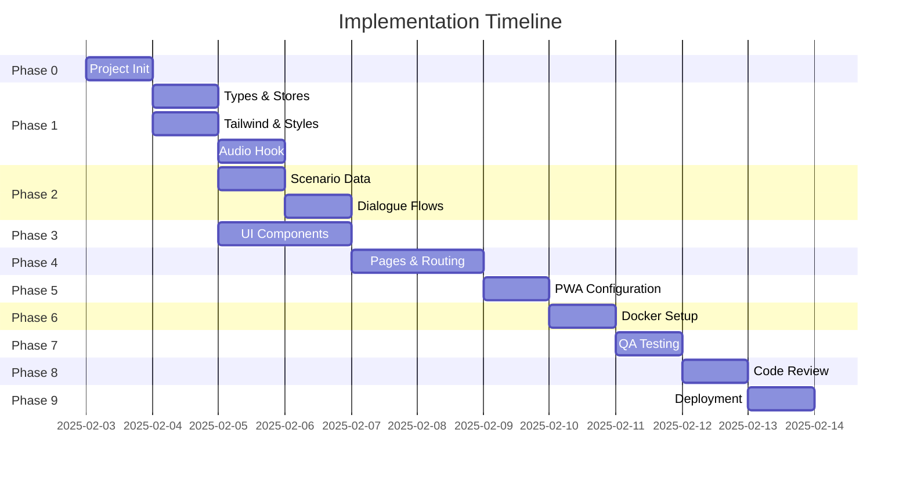

# Gulf Arabic Basics — Implementation Plan

**For execution with:** [claude-flow](https://github.com/ruvnet/claude-flow)
**Deployment:** Local Docker build → Vercel production
**Architecture:** Static PWA with Next.js 14 (App Router)

---

## Complexity Scale

| Size | Time Estimate | Token Estimate | Description |
|------|---------------|----------------|-------------|
| **XS** | < 15 min | ~500–1K | Trivial, boilerplate, commands |
| **S** | 15–30 min | ~1K–2K | Simple, well-defined, single file |
| **M** | 30 min – 1 hr | ~2K–5K | Moderate, some decisions, 1–2 files |
| **L** | 1–2 hrs | ~5K–10K | Substantial, multiple components |
| **XL** | 2–4 hrs | ~10K–20K | Complex, cross-cutting concerns |

---

## Task Summary

| Phase | Task | Complexity | Tokens | Agent | Dependencies |
|-------|------|------------|--------|-------|--------------|
| 0 | 0.1 Spawn Agent Team | XS | ~500 | — | — |
| 0 | 0.2 Create Next.js Project | S | ~1.5K | Frontend Dev 1 | — |
| 1 | 1.1 TypeScript Types | S | ~1.5K | Frontend Dev 1 | 0.2 |
| 1 | 1.2 Zustand Stores | M | ~3K | Frontend Dev 1 | 1.1 |
| 1 | 1.3 Tailwind Configuration | M | ~3K | Frontend Dev 2 | 0.2 |
| 1 | 1.4 Global Styles & Animations | M | ~2.5K | Frontend Dev 2 | 1.3 |
| 1 | 1.5 Audio Hook | M | ~3K | Frontend Dev 1 | 1.1 |
| 2 | 2.1 Scenario Data Structure | L | ~8K | Content Integrator | 1.1 |
| 2 | 2.2 Dialogue Flows | M | ~4K | Content Integrator | 2.1 |
| 2 | 2.3 useScenario Hook | S | ~1.5K | Frontend Dev 1 | 2.1 |
| 2 | 2.4 Audio Placeholder Files | XS | ~500 | Content Integrator | 2.1 |
| 3 | 3.1 Base UI Components | L | ~7K | Frontend Dev 2 | 1.3, 1.4 |
| 3 | 3.2 AudioButton Component | M | ~3K | Frontend Dev 2 | 1.5, 3.1 |
| 3 | 3.3 PhraseCard Component | M | ~2.5K | Frontend Dev 2 | 3.1, 3.2 |
| 3 | 3.4 ScenarioCard Component | S | ~2K | Frontend Dev 2 | 3.1 |
| 3 | 3.5 DialogueStep Component | M | ~3K | Frontend Dev 2 | 3.1, 3.2, 3.3 |
| 3 | 3.6 CompletionScreen Component | S | ~1.5K | Frontend Dev 2 | 3.1 |
| 4 | 4.1 Root Layout | M | ~3K | Frontend Dev 1 | 1.3, 1.4, 1.2 |
| 4 | 4.2 Home Page | M | ~3.5K | Frontend Dev 1 | 3.4, 1.2, 2.1 |
| 4 | 4.3 Learn Page | L | ~6K | Frontend Dev 1 | 3.3, 3.1, 1.2 |
| 4 | 4.4 Practice Page | L | ~7K | Frontend Dev 1 | 3.5, 3.6, 1.2 |
| 5 | 5.1 PWA Setup | M | ~3K | Frontend Dev 1 | 4.2 |
| 5 | 5.2 PWA Icons | S | ~1K | Content Integrator | 5.1 |
| 6 | 6.1 Dockerfile | M | ~2.5K | System Architect | 5.1 |
| 6 | 6.2 Docker Compose | S | ~1.5K | System Architect | 6.1 |
| 6 | 6.3 Docker Scripts | XS | ~500 | System Architect | 6.2 |
| 7 | 7.1 Manual Testing Checklist | L | ~5K | QA Engineer | 4.4, 5.1 |
| 7 | 7.2 Accessibility Check | M | ~2.5K | QA Engineer | 7.1 |
| 7 | 7.3 Performance Validation | M | ~2.5K | Performance Eng | 7.1 |
| 8 | 8.1 Architecture Review | M | ~3K | Code Reviewer | 7.1 |
| 8 | 8.2 Code Quality Review | M | ~2.5K | Code Reviewer | 8.1 |
| 9 | 9.1 Local Docker Verification | M | ~2K | System Architect | 7.3, 8.2 |
| 9 | 9.2 Vercel Deployment | M | ~2.5K | System Architect | 9.1 |
| 9 | 9.3 Post-Deployment Verification | S | ~1.5K | QA Engineer | 9.2 |

**Totals by Complexity:**

| Size | Count | Est. Time | Est. Tokens |
|------|-------|-----------|-------------|
| XS | 3 | ~30 min | ~1.5K |
| S | 8 | ~3 hrs | ~12K |
| M | 17 | ~12 hrs | ~51K |
| L | 6 | ~9 hrs | ~38K |
| **Total** | **34** | **~24 hrs** | **~102K** |

---

## Swarm Configuration

```bash
# Initialize swarm for medium project
claude-flow swarm init --topology hierarchical --max-agents 8 --strategy specialized
```

### Agent Team Composition

| Agent | Type | Role |
|-------|------|------|
| Project Lead | coordinator | Orchestrates all phases, manages dependencies |
| System Architect | architect | Technical decisions, structure validation |
| Frontend Dev 1 | coder | Core components, routing, state |
| Frontend Dev 2 | coder | UI components, styling, animations |
| Content Integrator | coder | Data files, audio integration |
| QA Engineer | tester | Testing, validation, accessibility |
| Code Reviewer | reviewer | Code quality, security review |
| Performance Eng | optimizer | Bundle optimization, PWA tuning |

---

## Phase 0: Project Initialization

### Task 0.1: Spawn Agent Team
**Complexity:** XS (< 15 min)
```bash
claude-flow agent spawn --type coordinator --name "Project Lead"
claude-flow agent spawn --type architect --name "System Architect"
claude-flow agent spawn --type coder --name "Frontend Dev 1"
claude-flow agent spawn --type coder --name "Frontend Dev 2"
claude-flow agent spawn --type coder --name "Content Integrator"
claude-flow agent spawn --type tester --name "QA Engineer"
claude-flow agent spawn --type reviewer --name "Code Reviewer"
claude-flow agent spawn --type optimizer --name "Performance Eng"
```

### Task 0.2: Create Next.js Project
**Complexity:** S (15–30 min)
**Agent:** Frontend Dev 1
**Priority:** critical
**Dependencies:** none

```bash
Task("Initialize Next.js project", "
  Create Next.js 14 project with App Router:
  - npx create-next-app@latest arabic --typescript --tailwind --eslint --app --src-dir
  - Install dependencies: zustand, next-pwa
  - Verify project structure matches architecture.md
  - Create initial folder structure:
    - src/components/ui/
    - src/components/
    - src/data/
    - src/store/
    - src/hooks/
    - src/types/
    - src/lib/
    - public/audio/
    - public/icons/
", "coder")
```

**Acceptance Criteria:**
- [ ] Next.js 14 project created with TypeScript
- [ ] Tailwind CSS configured
- [ ] Zustand installed
- [ ] next-pwa installed as dev dependency
- [ ] Folder structure matches architecture.md

---

## Phase 1: Core Infrastructure

### Task 1.1: TypeScript Types
**Complexity:** S (15–30 min)
**Agent:** Frontend Dev 1
**Priority:** high
**Dependencies:** Task 0.2

```bash
Task("Define TypeScript interfaces", "
  Create src/types/index.ts with interfaces:
  - Phrase: id, arabic, transliteration, meaning, audioFile
  - DialogueStep: id, speaker (user|local), phraseId, prompt
  - Scenario: id, title, description, icon, phrases[], dialogue[]
  - UserProgress: completedScenarios[], currentScenario, currentPhraseIndex, lastActiveAt
  - UserSettings: theme (light|dark|system)

  Reference: architecture.md Section 4 Data Model
", "coder")
```

### Task 1.2: Zustand Stores
**Complexity:** M (30 min – 1 hr)
**Agent:** Frontend Dev 1
**Priority:** high
**Dependencies:** Task 1.1

```bash
Task("Implement Zustand stores", "
  Create state management stores with localStorage persistence:

  1. src/store/useProgressStore.ts
     - State: completedScenarios, currentScenario, currentPhraseIndex, lastActiveAt
     - Actions: completeScenario, setCurrentScenario, setCurrentPhraseIndex, resetProgress
     - Use persist middleware with key 'gulf-arabic-progress'

  2. src/store/useSettingsStore.ts
     - State: theme
     - Actions: setTheme
     - Use persist middleware with key 'gulf-arabic-settings'

  Reference: architecture.md Section 6 State Management
", "coder")
```

### Task 1.3: Tailwind Configuration
**Complexity:** M (30 min – 1 hr)
**Agent:** Frontend Dev 2
**Priority:** high
**Dependencies:** Task 0.2

```bash
Task("Configure Tailwind design system", "
  Update tailwind.config.ts with design tokens from PRD:

  Colors (light mode):
  - cream: #FDF8F3, sand: #F5EDE4, terracotta: #C17A5A
  - warm-brown: #8B6F5C, charcoal: #3D3530, warm-gray: #7A6F66
  - sage: #7D9B76, sienna: #A65D3F

  Colors (dark mode):
  - deep-brown: #1F1A17, warm-charcoal: #2D2622, soft-terracotta: #D4896B
  - muted-sand: #A69383, warm-white: #F5EDE4, dusty-rose: #9C8B80
  - soft-sage: #8FAA87, coral: #C4785C

  Typography:
  - fontFamily.sans: ['Nunito', 'Quicksand', 'sans-serif']
  - fontFamily.arabic: ['Noto Sans Arabic', 'sans-serif']

  Border radius: card: 16px, button: 12px
  Transition durations: fade: 300ms, card: 250ms, pulse: 200ms, progress: 400ms

  Enable darkMode: 'class'

  Reference: prd.md Section 4 Color Palette, architecture.md Section 9
", "coder")
```

### Task 1.4: Global Styles & Animations
**Complexity:** M (30 min – 1 hr)
**Agent:** Frontend Dev 2
**Priority:** high
**Dependencies:** Task 1.3

```bash
Task("Create global styles and animations", "
  Update src/app/globals.css:

  1. Import Google Fonts (Nunito, Noto Sans Arabic) via next/font in layout.tsx

  2. Define CSS animations in @layer components:
     - animate-fade-in: fadeIn 300ms ease-out
     - animate-card-reveal: cardReveal 250ms ease-out (scale 0.95 to 1)
     - animate-pulse-gentle: pulseGentle 200ms ease-in-out
     - animate-progress-fill: progressFill 400ms ease-out

  3. Define @keyframes for each animation

  Reference: architecture.md Section 9 CSS Animation Classes
", "coder")
```

### Task 1.5: Audio Hook
**Complexity:** M (30 min – 1 hr)
**Agent:** Frontend Dev 1
**Priority:** high
**Dependencies:** Task 1.1

```bash
Task("Implement useAudio hook", "
  Create src/hooks/useAudio.ts:

  - Takes audioFile string parameter
  - Returns: isPlaying, isLoading, error, play(), stop()
  - Uses useRef for HTMLAudioElement
  - Handles play/pause/error states
  - Audio path: /audio/{audioFile}
  - Handle 'ended' event to reset isPlaying
  - Handle 'error' event gracefully (show 'Audio unavailable')

  Reference: architecture.md Section 10 Audio Handling
", "coder")
```

---

## Phase 2: Content Integration

### Task 2.1: Scenario Data Structure
**Complexity:** L (1–2 hrs)
**Agent:** Content Integrator
**Priority:** high
**Dependencies:** Task 1.1

```bash
Task("Create scenario data file", "
  Create src/data/scenarios.ts with all 60 phrases across 4 scenarios:

  Scenario 1: greetings (15 phrases)
  - id: 'greetings'
  - title: 'Greetings & Small Talk'
  - description: 'Make connections at networking events'
  - icon: '👋'

  Scenario 2: workplace (15 phrases)
  - id: 'workplace'
  - title: 'Workplace'
  - description: 'Daily interactions with colleagues'
  - icon: '💼'

  Scenario 3: coffee-shop (10 phrases)
  - id: 'coffee-shop'
  - title: 'Coffee Shop'
  - description: 'Order your morning coffee like a local'
  - icon: '☕'

  Scenario 4: common-expressions (20 phrases)
  - id: 'common-expressions'
  - title: 'Common Expressions'
  - description: 'Phrases that work everywhere'
  - icon: '💬'

  Each phrase needs: id (kebab-case), arabic, transliteration, meaning, audioFile

  Reference: prd.md Section 3 Content Requirements (full phrase tables)
", "coder")
```

### Task 2.2: Dialogue Flows
**Complexity:** M (30 min – 1 hr)
**Agent:** Content Integrator
**Priority:** medium
**Dependencies:** Task 2.1

```bash
Task("Create dialogue flows for each scenario", "
  Add dialogue arrays to each scenario in src/data/scenarios.ts:

  Each DialogueStep needs:
  - id: step-1, step-2, etc.
  - speaker: 'user' or 'local'
  - phraseId: references a phrase in the scenario
  - prompt: context text (e.g., 'The barista greets you warmly')

  Create realistic conversation flows:
  - Greetings: networking event introduction sequence
  - Workplace: morning office arrival sequence
  - Coffee Shop: ordering and paying sequence
  - Common: practice responding to various situations

  Each scenario should have 5-8 dialogue steps that use the scenario's phrases.
", "coder")
```

### Task 2.3: useScenario Hook
**Complexity:** S (15–30 min)
**Agent:** Frontend Dev 1
**Priority:** medium
**Dependencies:** Task 2.1

```bash
Task("Implement useScenario hook", "
  Create src/hooks/useScenario.ts:

  - getScenarios(): returns all scenarios
  - getScenarioById(id): returns single scenario or undefined
  - getPhraseById(scenarioId, phraseId): returns single phrase
  - getDialogueSteps(scenarioId): returns dialogue array

  Import scenarios from src/data/scenarios.ts
", "coder")
```

### Task 2.4: Audio Placeholder Files
**Complexity:** XS (< 15 min)
**Agent:** Content Integrator
**Priority:** low
**Dependencies:** Task 2.1

```bash
Task("Create audio file placeholders", "
  Create placeholder audio files in public/audio/:

  For each of the 60 phrases, create a placeholder file:
  - Use kebab-case naming matching phrase IDs
  - Example: as-salamu-alaykum.mp3, sabah-al-khayr.mp3

  Option A: Create silent MP3 placeholders (1 second each)
  Option B: Create a manifest.json listing all required audio files

  This allows development to proceed while audio is sourced from Forvo/ElevenLabs.
", "coder")
```

---

## Phase 3: UI Components

### Task 3.1: Base UI Components
**Complexity:** L (1–2 hrs)
**Agent:** Frontend Dev 2
**Priority:** high
**Dependencies:** Task 1.3, Task 1.4

```bash
Task("Create base UI components", "
  Create reusable UI primitives in src/components/ui/:

  1. Button.tsx
     - Variants: primary (terracotta), secondary (warm-brown), ghost
     - Sizes: sm, md, lg
     - Rounded corners (border-radius-button)
     - Hover/active states with transitions

  2. Card.tsx
     - Background: sand (light) / warm-charcoal (dark)
     - Rounded corners (border-radius-card)
     - Soft shadow
     - animate-card-reveal on mount

  3. ProgressDots.tsx
     - Props: total, current
     - Dots with active/inactive states
     - Smooth transition between states

  4. ThemeToggle.tsx
     - Sun/moon icons
     - Toggles dark class on document
     - Syncs with useSettingsStore

  Reference: prd.md Section 4 UX/Design Direction
", "coder")
```

### Task 3.2: AudioButton Component
**Complexity:** M (30 min – 1 hr)
**Agent:** Frontend Dev 2
**Priority:** high
**Dependencies:** Task 1.5, Task 3.1

```bash
Task("Create AudioButton component", "
  Create src/components/AudioButton.tsx:

  - Props: audioFile, size (default 48px)
  - Uses useAudio hook
  - Speaker icon (play state) / Loading spinner / Error state
  - Pulse animation when ready
  - Large tap target (min 48pt)
  - Colors: sienna/coral for audio accent

  States:
  - Idle: speaker icon, pulse animation
  - Loading: spinner
  - Playing: filled speaker icon
  - Error: muted icon with 'Audio unavailable' tooltip
", "coder")
```

### Task 3.3: PhraseCard Component
**Complexity:** M (30 min – 1 hr)
**Agent:** Frontend Dev 2
**Priority:** high
**Dependencies:** Task 3.1, Task 3.2

```bash
Task("Create PhraseCard component", "
  Create src/components/PhraseCard.tsx:

  Props: phrase (Phrase type)

  Layout (centered, generous whitespace):
  1. Transliteration - large, Nunito 600-700, 28-32px
  2. Arabic script - small, Noto Sans Arabic, 14-16px, muted color
  3. English meaning - medium, 16-18px
  4. AudioButton - centered below text

  Animation: animate-fade-in on mount

  Reference: prd.md Section 4 Screen Layout
", "coder")
```

### Task 3.4: ScenarioCard Component
**Complexity:** S (15–30 min)
**Agent:** Frontend Dev 2
**Priority:** medium
**Dependencies:** Task 3.1

```bash
Task("Create ScenarioCard component", "
  Create src/components/ScenarioCard.tsx:

  Props: scenario (Scenario type), isCompleted (boolean), onClick

  Layout:
  - Icon (emoji) on left
  - Title and description
  - Checkmark if completed (sage/soft-sage color)
  - Chevron right

  States:
  - Default: clickable, hover state
  - Completed: checkmark icon, slightly muted

  Animation: subtle hover scale
", "coder")
```

### Task 3.5: DialogueStep Component
**Complexity:** M (30 min – 1 hr)
**Agent:** Frontend Dev 2
**Priority:** medium
**Dependencies:** Task 3.1, Task 3.2, Task 3.3

```bash
Task("Create DialogueStep component", "
  Create src/components/DialogueStep.tsx:

  Props: step (DialogueStep), phrase (Phrase), isRevealed, onReveal

  Layout:
  - Prompt text at top (context)
  - Card that reveals phrase on tap
  - If speaker is 'local': align left, different background
  - If speaker is 'user': align right, primary background

  States:
  - Hidden: shows 'Tap to reveal' with prompt
  - Revealed: shows PhraseCard with audio button

  Animation: animate-card-reveal on reveal
", "coder")
```

### Task 3.6: CompletionScreen Component
**Complexity:** S (15–30 min)
**Agent:** Frontend Dev 2
**Priority:** medium
**Dependencies:** Task 3.1

```bash
Task("Create CompletionScreen component", "
  Create src/components/CompletionScreen.tsx:

  Props: scenario (Scenario), onContinue

  Layout:
  - Success icon/emoji (🎉 or checkmark)
  - 'Scenario completed!' message
  - Scenario title
  - Stats: X phrases learned
  - 'Continue' button → navigates home

  Animation: celebration moment (slightly longer, satisfying)
", "coder")
```

---

## Phase 4: Pages & Routing

### Task 4.1: Root Layout
**Complexity:** M (30 min – 1 hr)
**Agent:** Frontend Dev 1
**Priority:** high
**Dependencies:** Task 1.3, Task 1.4, Task 1.2

```bash
Task("Create root layout", "
  Update src/app/layout.tsx:

  1. Import fonts using next/font:
     - Nunito (400, 500, 600, 700)
     - Noto Sans Arabic (400)

  2. Apply font variables to body

  3. Add theme detection:
     - Check useSettingsStore for theme preference
     - Apply 'dark' class to html element if dark mode
     - Handle 'system' preference with matchMedia

  4. Metadata:
     - title: 'Gulf Arabic Basics'
     - description: 'Learn practical Gulf Arabic phrases'

  5. Wrap children in providers if needed
", "coder")
```

### Task 4.2: Home Page
**Complexity:** M (30 min – 1 hr)
**Agent:** Frontend Dev 1
**Priority:** high
**Dependencies:** Task 3.4, Task 1.2, Task 2.1

```bash
Task("Create home page", "
  Create src/app/page.tsx:

  Layout:
  1. Header: 'Yalla, let's learn!' + ThemeToggle
  2. Scenario list (4 ScenarioCards)
  3. Each card shows completion status from useProgressStore

  Behavior:
  - Load scenarios from useScenario hook
  - Check completedScenarios from useProgressStore
  - On card click → navigate to /learn/[scenarioId]

  Animation: staggered fade-in for cards
", "coder")
```

### Task 4.3: Learn Page
**Complexity:** L (1–2 hrs)
**Agent:** Frontend Dev 1
**Priority:** high
**Dependencies:** Task 3.3, Task 3.1, Task 1.2

```bash
Task("Create learn page", "
  Create src/app/learn/[scenarioId]/page.tsx:

  Layout:
  1. Header: back arrow + scenario title
  2. PhraseCard (current phrase)
  3. ProgressDots (current/total)
  4. Navigation: left/right arrows or 'Continue' button

  Behavior:
  - Get scenarioId from params
  - Load scenario from useScenario hook
  - Track current phrase index in local state
  - Update useProgressStore.currentPhraseIndex
  - On last phrase 'Continue' → navigate to /practice/[scenarioId]

  Handle: scenario not found → redirect home
", "coder")
```

### Task 4.4: Practice Page
**Complexity:** L (1–2 hrs)
**Agent:** Frontend Dev 1
**Priority:** high
**Dependencies:** Task 3.5, Task 3.6, Task 1.2

```bash
Task("Create practice page", "
  Create src/app/practice/[scenarioId]/page.tsx:

  Layout:
  1. Header: back arrow + 'Practice: [scenario title]'
  2. DialogueStep components (one at a time or scrollable)
  3. Progress indicator

  Behavior:
  - Get scenarioId from params
  - Load scenario and dialogue from useScenario hook
  - Track revealed steps in local state
  - User taps to reveal each step
  - After all steps revealed → show CompletionScreen
  - On completion → call useProgressStore.completeScenario(scenarioId)
  - Navigate home

  Handle: scenario not found → redirect home
", "coder")
```

---

## Phase 5: PWA Configuration

### Task 5.1: PWA Setup
**Complexity:** M (30 min – 1 hr)
**Agent:** Frontend Dev 1
**Priority:** high
**Dependencies:** Task 4.2

```bash
Task("Configure PWA with next-pwa", "
  1. Update next.config.js:
     - Import and configure next-pwa
     - Set dest: 'public'
     - Enable register and skipWaiting
     - Disable in development
     - Set output: 'export' for static build
     - Set images.unoptimized: true

  2. Create public/manifest.json:
     - name: 'Gulf Arabic Basics'
     - short_name: 'Yalla'
     - start_url: '/'
     - display: 'standalone'
     - background_color: '#FDF8F3'
     - theme_color: '#C17A5A'
     - icons: 192x192 and 512x512

  3. Add manifest link to layout.tsx head

  4. Update .gitignore:
     - public/sw.js
     - public/workbox-*.js

  Reference: architecture.md Section 8 PWA Configuration
", "coder")
```

### Task 5.2: PWA Icons
**Complexity:** S (15–30 min)
**Agent:** Content Integrator
**Priority:** medium
**Dependencies:** Task 5.1

```bash
Task("Create PWA icons", "
  Create app icons in public/icons/:

  1. icon-192.png (192x192)
  2. icon-512.png (512x512)

  Design:
  - Simple, recognizable mark
  - Use terracotta (#C17A5A) as primary color
  - Works on both light and dark backgrounds
  - Could be: Arabic letter, speech bubble, desert-inspired shape

  For MVP: can use a simple colored square with 'ي' (ya) letter
", "coder")
```

---

## Phase 6: Docker Configuration

### Task 6.1: Dockerfile
**Complexity:** M (30 min – 1 hr)
**Agent:** System Architect
**Priority:** high
**Dependencies:** Task 5.1

```bash
Task("Create Dockerfile for local build", "
  Create Dockerfile in project root:

  Multi-stage build:

  Stage 1 - Dependencies:
  - FROM node:20-alpine AS deps
  - Copy package.json, package-lock.json
  - Run npm ci

  Stage 2 - Builder:
  - FROM node:20-alpine AS builder
  - Copy deps node_modules
  - Copy source code
  - Run npm run build

  Stage 3 - Runner:
  - FROM node:20-alpine AS runner
  - Set NODE_ENV=production
  - Copy built assets from builder
  - Copy public folder
  - Expose port 3000
  - CMD ['npm', 'start']

  For static export, serve with a simple HTTP server instead.
", "architect")
```

### Task 6.2: Docker Compose
**Complexity:** S (15–30 min)
**Agent:** System Architect
**Priority:** high
**Dependencies:** Task 6.1

```bash
Task("Create docker-compose.yml", "
  Create docker-compose.yml:

  services:
    app:
      build: .
      ports:
        - '3000:3000'
      volumes:
        - ./public/audio:/app/public/audio  # Mount audio for easy updates
      environment:
        - NODE_ENV=production

  Add development override docker-compose.dev.yml:
  - Mount source code for hot reload
  - Use npm run dev instead
", "architect")
```

### Task 6.3: Docker Scripts
**Complexity:** XS (< 15 min)
**Agent:** System Architect
**Priority:** medium
**Dependencies:** Task 6.2

```bash
Task("Add Docker convenience scripts", "
  Update package.json scripts:

  'docker:build': 'docker build -t gulf-arabic-basics .'
  'docker:run': 'docker run -p 3000:3000 gulf-arabic-basics'
  'docker:dev': 'docker-compose -f docker-compose.yml -f docker-compose.dev.yml up'
  'docker:prod': 'docker-compose up --build'

  Create .dockerignore:
  - node_modules
  - .next
  - .git
  - *.md
  - .env*
", "architect")
```

---

## Phase 7: Quality Assurance

### Task 7.1: Manual Testing Checklist
**Complexity:** L (1–2 hrs)
**Agent:** QA Engineer
**Priority:** high
**Dependencies:** Task 4.4, Task 5.1

```bash
Task("Execute manual testing checklist", "
  Test all user flows:

  First-time user:
  [ ] App loads within 2 seconds
  [ ] Home shows 4 scenarios
  [ ] Can tap into Greetings scenario
  [ ] Phrases display correctly (transliteration, Arabic, meaning)
  [ ] Audio plays on tap
  [ ] Can navigate through all phrases
  [ ] Practice flow works (tap to reveal)
  [ ] Completion screen shows
  [ ] Progress persists after refresh

  Returning user:
  [ ] Completed scenarios show checkmark
  [ ] Progress loads from localStorage
  [ ] Can replay completed scenarios

  Theme:
  [ ] Light mode displays correctly
  [ ] Dark mode displays correctly
  [ ] Theme persists after refresh
  [ ] System preference works

  PWA:
  [ ] Can add to home screen (mobile)
  [ ] Works offline after caching
  [ ] Manifest loads correctly

  Edge cases:
  [ ] Audio error handled gracefully
  [ ] Invalid route redirects home
  [ ] Works on mobile viewport
  [ ] Works on desktop viewport
", "tester")
```

### Task 7.2: Accessibility Check
**Complexity:** M (30 min – 1 hr)
**Agent:** QA Engineer
**Priority:** medium
**Dependencies:** Task 7.1

```bash
Task("Verify accessibility requirements", "
  Check WCAG compliance:

  [ ] Color contrast ratios meet AA standard
  [ ] All interactive elements have focus states
  [ ] Tap targets are minimum 44x44px
  [ ] Screen reader can navigate content
  [ ] Arabic text has correct dir='rtl' where needed
  [ ] Audio controls are keyboard accessible
  [ ] Progress is announced to screen readers
", "tester")
```

### Task 7.3: Performance Validation
**Complexity:** M (30 min – 1 hr)
**Agent:** Performance Eng
**Priority:** medium
**Dependencies:** Task 7.1

```bash
Task("Validate performance targets", "
  Run Lighthouse audit and verify:

  [ ] First Contentful Paint < 1.5s
  [ ] Time to Interactive < 2s
  [ ] Performance score > 90
  [ ] Bundle size < 100kb gzipped (excluding audio)
  [ ] Audio files load within 500ms

  Check bundle:
  [ ] Run 'npm run build' and check output size
  [ ] Verify no unexpected large dependencies
  [ ] Tree shaking working correctly
", "optimizer")
```

---

## Phase 8: Code Review

### Task 8.1: Architecture Review
**Complexity:** M (30 min – 1 hr)
**Agent:** Code Reviewer
**Priority:** high
**Dependencies:** Task 7.1

```bash
Task("Review architecture compliance", "
  Verify implementation matches architecture.md:

  [ ] Folder structure matches specification
  [ ] File naming conventions followed
  [ ] TypeScript interfaces match data model
  [ ] Zustand stores match specification
  [ ] Component hierarchy is correct
  [ ] No unnecessary dependencies added
  [ ] No backend/API code (should be static)
", "reviewer")
```

### Task 8.2: Code Quality Review
**Complexity:** M (30 min – 1 hr)
**Agent:** Code Reviewer
**Priority:** medium
**Dependencies:** Task 8.1

```bash
Task("Review code quality", "
  Check code quality standards:

  [ ] No TypeScript errors or warnings
  [ ] ESLint passes with no errors
  [ ] No console.log statements in production code
  [ ] No hardcoded strings that should be constants
  [ ] Consistent code formatting
  [ ] Components are properly typed
  [ ] No unused imports or variables
  [ ] Error boundaries in place
", "reviewer")
```

---

## Phase 9: Deployment

### Task 9.1: Local Docker Verification
**Complexity:** M (30 min – 1 hr)
**Agent:** System Architect
**Priority:** critical
**Dependencies:** Task 7.3, Task 8.2

```bash
Task("Verify local Docker build", "
  Run full Docker build and test:

  1. Build image: npm run docker:build
  2. Run container: npm run docker:run
  3. Verify app at http://localhost:3000
  4. Test all user flows in containerized environment
  5. Verify PWA works in container
  6. Check audio files are served correctly

  Document any issues for Vercel deployment.
", "architect")
```

### Task 9.2: Vercel Deployment
**Complexity:** M (30 min – 1 hr)
**Agent:** System Architect
**Priority:** critical
**Dependencies:** Task 9.1

```bash
Task("Deploy to Vercel", "
  Deploy static export to Vercel:

  1. Create vercel.json (if needed):
     {
       'buildCommand': 'npm run build',
       'outputDirectory': 'out',
       'framework': 'nextjs'
     }

  2. Connect GitHub repository to Vercel

  3. Configure build settings:
     - Framework: Next.js
     - Build command: npm run build
     - Output directory: out (for static export)

  4. Deploy and verify:
     - All routes work
     - PWA installable
     - Audio files accessible
     - HTTPS working

  5. Test on mobile device

  6. Share URL for user testing
", "architect")
```

### Task 9.3: Post-Deployment Verification
**Complexity:** S (15–30 min)
**Agent:** QA Engineer
**Priority:** high
**Dependencies:** Task 9.2

```bash
Task("Verify production deployment", "
  Test production environment:

  [ ] App loads on production URL
  [ ] All 4 scenarios accessible
  [ ] Audio plays correctly
  [ ] PWA installable on mobile
  [ ] Offline mode works after caching
  [ ] No console errors
  [ ] Performance targets met in production
  [ ] Share with test group (Canadians in UAE)
", "tester")
```

---

## Execution Order



---

## Agent Termination

After successful deployment:

```bash
# Verify all tasks complete
claude-flow task list --status completed

# Terminate agents
claude-flow agent terminate --all

# Or selectively keep for maintenance
claude-flow agent terminate "Frontend Dev 2"
claude-flow agent terminate "Content Integrator"
```

---

## References

- [PRD](/arabic/product/prd.md)
- [Architecture](/arabic/product/architecture.md)
- [claude-flow Documentation](https://github.com/ruvnet/claude-flow)
- [claude-flow Wiki](https://github.com/ruvnet/claude-flow/wiki)
